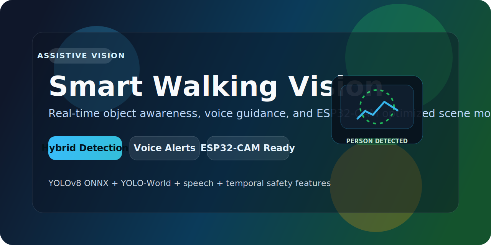
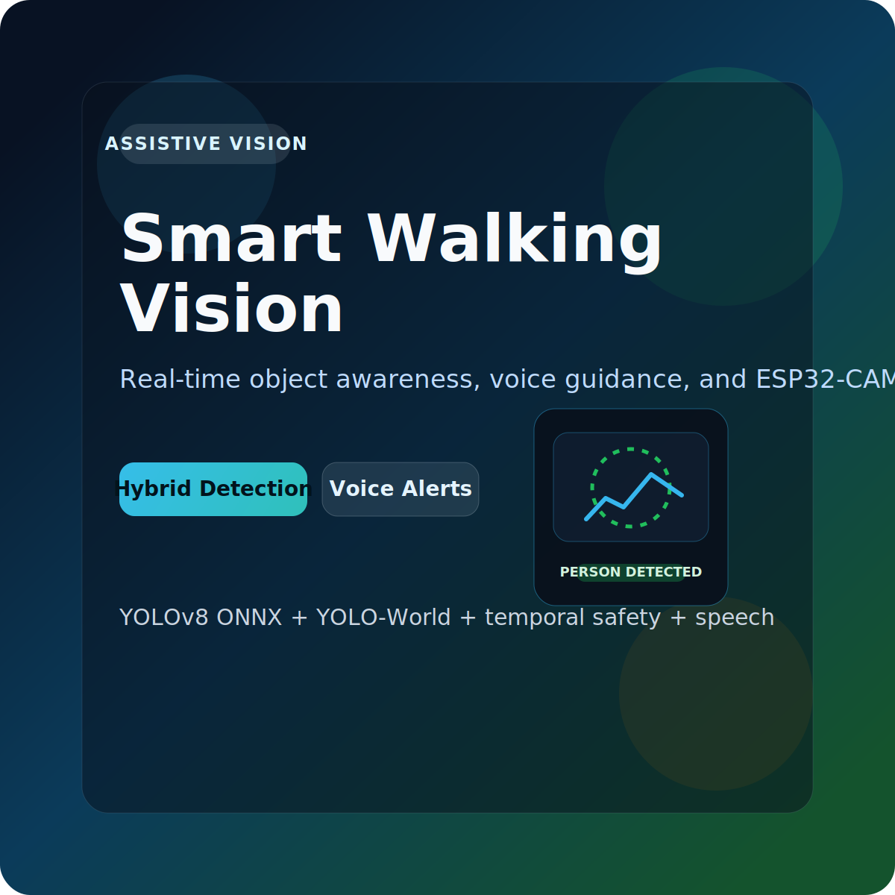

# Smart Walking Vision




Smart Walking Vision is an assistive computer-vision pipeline designed for walking-aid scenarios. It combines real-time object detection, spoken alerts, obstacle awareness, and optional fall-risk monitoring into a single system that can run from a local webcam or an ESP32-CAM.

## Product Overview

This project is built to answer three practical questions in real time:

- What is in front of the user?
- How close is it?
- Has something new entered the scene?

It is more than a demo overlay. The runtime is structured like a product pipeline, with attention to stability, speech behavior, configurable deployment, and low-cost camera hardware support.

## Product Snapshot



## What It Delivers

- Real-time object detection from webcam, file, stream, or ESP32-CAM snapshot feed.
- Natural voice alerts using `gTTS`.
- New-object-first announcements to reduce repetitive speech.
- Per-class counts with temporal smoothing.
- Proximity labels from `FAR` to `VERY CLOSE`.
- Optional pose-based fall-risk alerts.
- Multiple detection backends for different speed and coverage tradeoffs.

## Detection Stack

- `yolov3`: legacy OpenCV DNN baseline.
- `yolov8onnx`: better CPU efficiency and practical default backend.
- `yoloworld`: open-vocabulary detection for broader object and obstacle coverage.
- `hybrid`: fast YOLOv8 ONNX inference plus periodic YOLO-World scans.

## Product Features

### Assistive Awareness

- Detects people, everyday objects, and broader road or path obstacles.
- Announces only meaningful scene changes instead of repeating every frame.
- Displays urgency when objects are close.

### Runtime Stability

- Detection persistence reduces flicker.
- Temporal prediction improves continuity between inference frames.
- Async capture helps reduce stalls on supported sources.
- Speech cooldowns and global gaps reduce noise.

### ESP32-CAM Support

- Supports AI Thinker style ESP32-CAM snapshot endpoints.
- Accepts either direct image URLs or a base URL like `http://<ip>/`.
- Automatically applies ESP32-friendly tuning without removing the current optimization pipeline.

## Quick Start

### Install

```powershell
pip install -r requirements.txt
```

### Run on Webcam

```powershell
python .\improved_obj_detect.py --source 0
```

### Run Hybrid Mode

```powershell

```

### Run on ESP32-CAM

```powershell
python .\improved_obj_detect.py --source "http://<ip>/" --model-type hybrid
```

Press `q` to close the preview window.

## Input Sources

- Webcam: `--source 0`
- Alternate webcam: `--source 1`
- Video file or stream: `--source path_or_url`
- ESP32-CAM alias: `--source espcam`
- Direct snapshot URL: `--source http://<ip>/cam-hi.jpg`
- ESP32-CAM base URL: `--source http://<ip>/`

If a base ESP32 URL is supplied, the runtime resolves it to `cam-hi.jpg` automatically.

## ESP32-CAM Optimization

For ESP32 snapshot sources, the runtime keeps the existing detection pipeline and adds an automatic snapshot profile tuned for responsiveness and network instability.

Default ESP32 profile:

- `quality=fast`
- `model_size=320`
- `infer_every=2`
- `snapshot_timeout=2.0`
- `snapshot_retry_delay=0.08`

You can override these values manually:

```powershell
python .\improved_obj_detect.py --source "http://<ip>/" --model-type hybrid --snapshot-timeout 1.5 --snapshot-retry-delay 0.05
```

## Recommended Product Modes

| Scenario | Outcome | Command |
| --- | --- | --- |
| Indoor navigation | Balanced detection and smoother speech | `python .\improved_obj_detect.py --source 0 --model-type hybrid --quality balanced --infer-every 2 --hybrid-world-every 8 --persistence-window 5` |
| Outdoor obstacle awareness | Broader obstacle vocabulary | `python .\improved_obj_detect.py --source 0 --model-type hybrid --quality balanced --infer-every 2 --hybrid-world-every 6 --world-classes "person,car,bicycle,motorcycle,bus,truck,curb,pothole,speed bump,traffic cone,barrier,construction sign"` |
| CPU-first mode | Lower latency on CPU | `python .\improved_obj_detect.py --source 0 --model-type yolov8onnx --quality fast --infer-every 3 --prefer-int8 --persistence-window 4` |
| Fall monitoring | Adds pose-based fall-risk alerts | `python .\improved_obj_detect.py --source 0 --model-type hybrid --enable-fall-detection --pose-every 10 --infer-every 2` |
| ESP32-CAM hybrid | Broader scene coverage from IP camera snapshots | `python .\improved_obj_detect.py --source "http://<ip>/" --model-type hybrid --enable-fall-detection --pose-every 10` |

## Runtime Configuration

The runtime can be controlled through CLI flags or `config/runtime_defaults.json`.

This allows you to tune:

- backend selection,
- model paths,
- quality presets,
- YOLO-World class prompts,
- speech behavior,
- persistence behavior,
- fall-detection defaults,
- ESP32 snapshot behavior.

Example:

```powershell
python .\improved_obj_detect.py --config .\config\runtime_defaults.json --source 0
```

## Useful CLI Options

- `--model-type yolov3|yolov8onnx|yoloworld|hybrid`
- `--quality fast|balanced|accurate`
- `--infer-every N`
- `--hybrid-world-every N`
- `--world-classes "person,watch,cell phone,pothole,traffic cone"`
- `--persistence-window N`
- `--snapshot-timeout N`
- `--snapshot-retry-delay N`
- `--no-async-capture`
- `--disable-distance-estimation`
- `--enable-fall-detection`
- `--pose-model yolov8n-pose.pt`
- `--no-speech`
- `--speech-cooldown N`
- `--speech-gap N`

## Model Export and Optimization

Export YOLOv8 to ONNX:

```powershell
python -c "from ultralytics import YOLO; YOLO('yolov8n.pt').export(format='onnx', imgsz=640, opset=12, simplify=True)"
```

Quantize the ONNX model to INT8:

```powershell
python .\tools\quantize_onnx.py --input .\yolov8n.onnx --output .\yolov8n.int8.onnx
```

Use the INT8 model at runtime:

```powershell
python .\improved_obj_detect.py --source 0 --model-type yolov8onnx --prefer-int8 --onnx-int8-path .\yolov8n.int8.onnx
```

## Project Structure

```text
# Smart Walking Vision


.
|-- coco.names
|-- yolov3.cfg
|-- detector/
|   |-- runtime/      # CLI, config, orchestration
|   |-- backends/     # YOLOv3, YOLOv8 ONNX, YOLO-World, merge logic
|   |-- io/           # source handling and speech output
|   |-- safety/       # temporal smoothing, proximity, fall logic
|-- config/
|   |-- runtime_defaults.json
|-- tools/
|   |-- quantize_onnx.py
|-- espcam_code/
|-- dist_node_server/
|-- ip_nodemcu/
```

## Hardware Components

This repository also includes embedded code used with the vision runtime:

- `espcam_code/`: ESP32-CAM firmware for image endpoints.
- `dist_node_server/`: distance-node firmware.
- `ip_nodemcu/`: NodeMCU connectivity helper firmware.

The Python pipeline can be developed and tested independently.

## Troubleshooting

### Webcam Does Not Open

- Close any application already using the camera.
- Try another camera index such as `--source 1`.

### ESP32-CAM Times Out

- Use `--source "http://<ip>/"`.
- Keep the ESP32 profile defaults unless you need to tune them.
- Reduce `--snapshot-timeout` slightly and retry faster if the network is unstable.

### Low FPS

- Use `--quality fast`.
- Increase `--infer-every`.
- Use `--prefer-int8` with a quantized ONNX model.

### Repeated Speech Alerts

- Increase `--speech-gap`.
- Increase `--speech-cooldown`.

## Current Status

This is a working prototype focused on assistive navigation experiments, modular runtime design, and practical deployment on both local cameras and low-cost network camera hardware.
